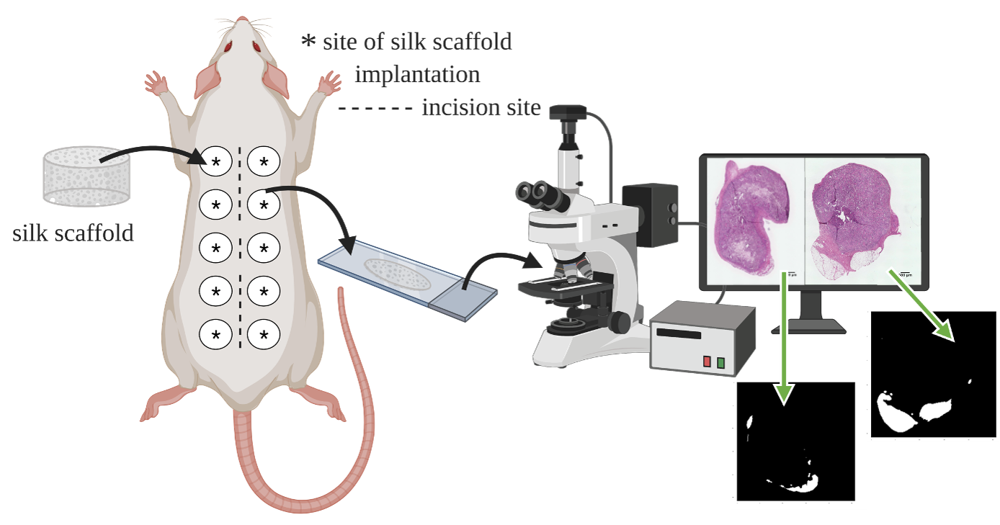

# Jointly Optimized Spatial Histogram UNET Architecture (JOSHUA) for Adipose Tissue Segmentation:



_Joshua K. Peeples, Julie F. Jameson, Nisha M. Kotta, Jonathan M. Grasman, Whitney L. Stoppel, and Alina Zare_

Note: If this code is used, cite it: Joshua Peeples, Julie Jameson, Nisha Kotta, 
Jonathan M. Grasman, Whitney Stoppel, and Alina Zare. 
(2021, November 23). GatorSense/Histological_Segmentation: Initial Release (Version v1.0). 
Zendo. https://doi.org/10.5281/zenodo.5722339
[](https://doi.org/10.5281/zenodo.5722339)

[[`BMEF`](https://spj.sciencemag.org/journals/bmef/2022/9854084/)]

[[`bioRxiv`](https://www.biorxiv.org/content/early/2021/11/23/2021.11.22.469463)]

[[`BibTeX`](#CitingHist)]


In this repository, we provide the paper and the code for the histological 
segmentation models from "Jointly Optimized Spatial Histogram UNET 
Architecture (JOSHUA) for Adipose Tissue Segmentation."

## Installation Prerequisites

This code uses python, pytorch, numpy, Pillow, tensorboard, and future. 
Please use [[`Pytorch's website`](https://pytorch.org/get-started/locally/)] to download necessary packages.

## Demo

Run `demo.py` in Python IDE (e.g., Spyder) or command line. To evaluate performance,
run `View_Results.py` (if results are saved out).

## Main Functions

The segmentation models (U-Net, Attention U-Net, U-Net+, JOSHUA, and JOSHUA+)
run using the following functions. 

1. Prepare dataset(s) for model 

 ```indices = Prepare_Dataloaders(**Parameters)```

2. Intialize model

 ```model = intialize_model(**Parameters)```

3. Train model 

```train_dict = train_net(**Parameters)```

4. Validate and/or test model

```test_dict = eval_net(**Parameters)```


## Parameters
The parameters can be set in the following script:

```Demo_Parameters.py```

## Inventory

```
https://github.com/GatorSense/Histological_Segmentation

└── root dir
    ├── demo.py   //Run this. Main demo file.
    ├── Demo_Parameters.py // Parameters file for demo.
    ├── generate_supplemental.py // Generate intensity histograms for positive and negative samples as well as save file names for adipose poor samples.
    ├── Image Name, Week, and Condition.csv // Image name, week, and condition information for SFBHI.
    ├── Labeled Image Reference Length.csv // Adipose tissue information for SFBHI.
    ├── Prepare_Data.py  // Load data for demo file.
    ├── View_Results.py // Run this after demo to view saved results.
    └── Utils  //utility functions
        ├── Capture_Metrics.py  // Record evaluation metrics in excel spreadsheet.
        ├── create_dataloaders.py  // Generate Pytorch dataloaders for each dataset.
        ├── Create_Fat_Spreadsheet.py  // Create spreadsheet of estimated adipose tissue.
        ├── create_individual_RGB_figures.py  // Create figures to display segmentation results.
        ├── dataset.py  // Load training, validation, and test splits.
        ├── decode_segmentation.py  // Generate colors for output segmentation maps (for multi-class segmentation only).
        ├── eval.py  // Evaluate models on validation and test data.
        ├── functional.py  // Contains functions to compute evaluation metrics.
        ├── Initialize_Model.py  // Initialize segmentation model(s).
        ├── metrics.py  // Compute additional metrics to evaluate model's performance.
        ├── pytorchtools.py  // Implement early stopping to terminate training based on validation metrics.
        ├── RBFHistogramPooling.py  // Create histogram layer. 
        ├── Save_Results.py  // Save results from demo script.
        ├── train.py  // Train and evaluate model.
        ├── utils.py  // Functions for data augmentation.
        └── models  // individual model parts
            ├── attention_unet_model.py  // Attention U-Net model.
            ├── Histogram_Model.py  // JOSHUA/JOSHUA+ model.
            ├── histunet_parts.py  // Individual components for JOSHUA/JOSHUA+ models.
            ├── unet_model.py  // U-Net model.
            ├── unet_parts.py  // Individual components for U-Net model.
```

## License

This source code is licensed under the license found in the [`LICENSE`](LICENSE) 
file in the root directory of this source tree.

This product is Copyright (c) 2021 J. Peeples, J. Jameson, N. Kotta, J. Grasman,
W. Stoppel, and A. Zare. All rights reserved.

## <a name="CitingHist"></a>Citing Histological Segmentation

If you use the histological segmentation code, please cite the paper using the 
following entry.

**Plain Text:**

J. Peeples, J. Jameson, N. Kotta, J. Grasman, W. Stoppel, and A. Zare, “Jointly Optimized Spatial Histogram UNET
Architecture (JOSHUA) for Adipose Tissue Segmentation,” in BME Frontiers, vol. 2022, doi: 10.34133/2022/9854084.

**BibTex:**
```
@article{peeples2022jointly,
  title={Jointly Optimized Spatial Histogram UNET Architecture (JOSHUA) for Adipose Tissue Segmentation},
  author={Peeples, Joshua K and Jameson, Julie F and Kotta, Nisha M and Grasman, Jonathan M and Stoppel, Whitney L and Zare, Alina},
  journal={BME Frontiers},
  volume={2022},
  year={2022},
  publisher={AAAS}
}
```

